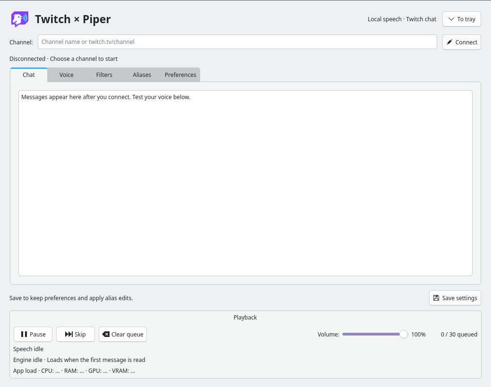
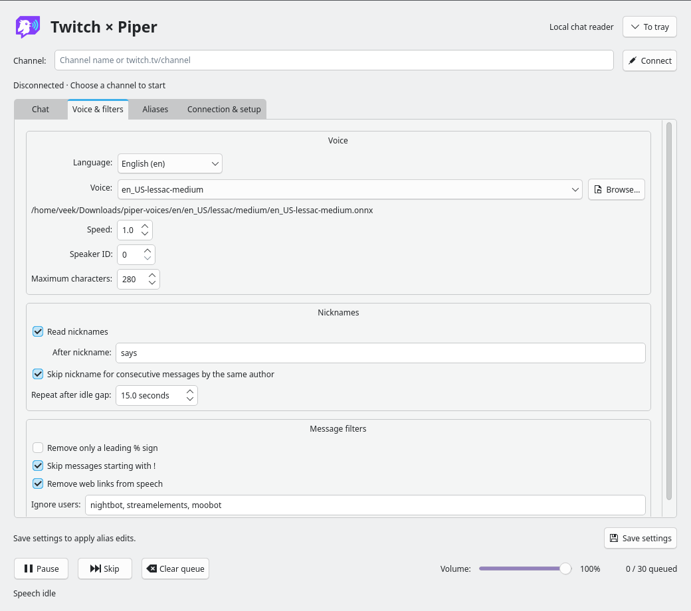
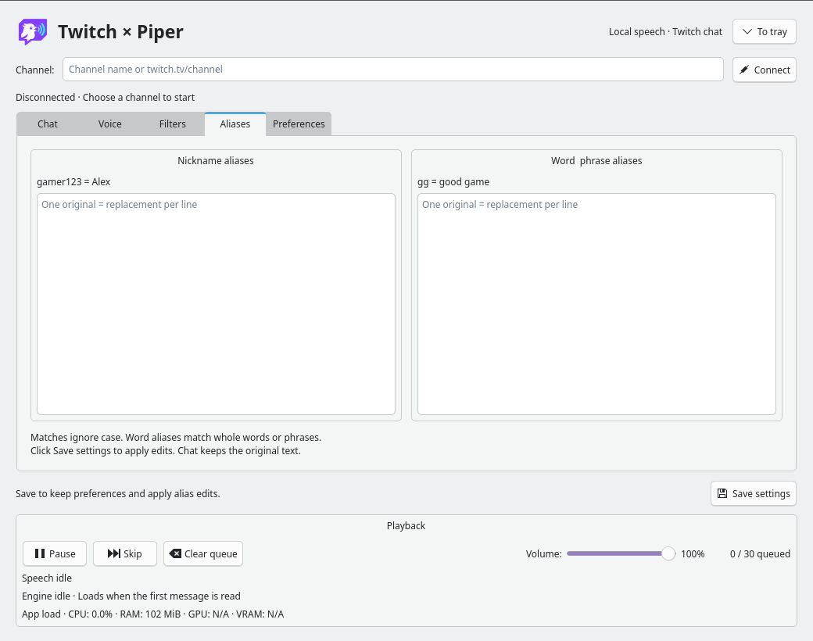
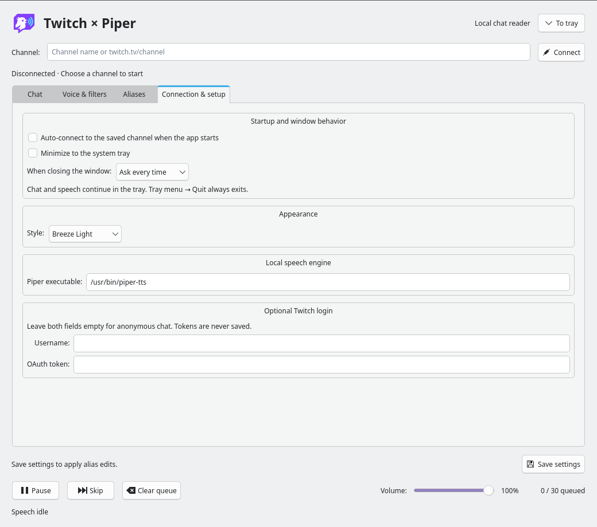
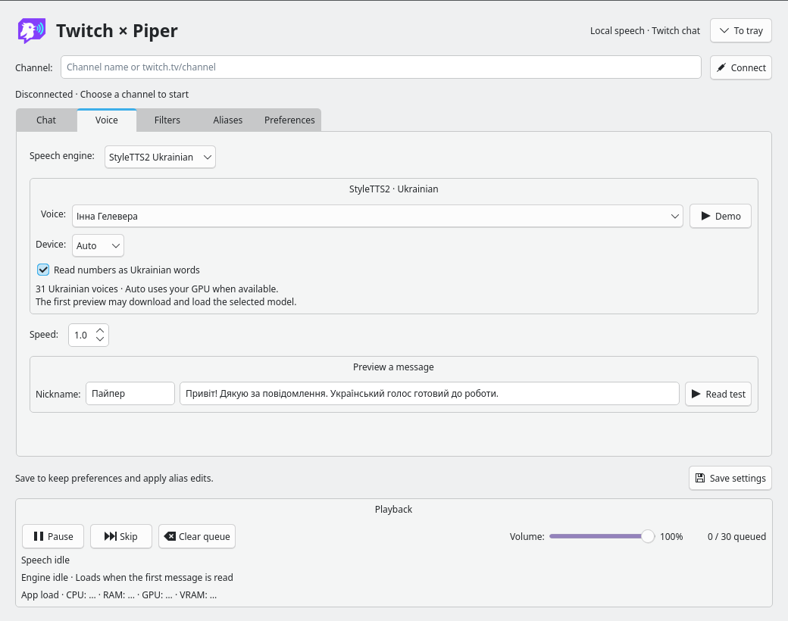

# Twitch × Piper

A Linux desktop app that reads Twitch chat aloud using local [Piper TTS](https://github.com/OHF-Voice/piper1-gpl) or optional Ukrainian [StyleTTS2](https://huggingface.co/spaces/patriotyk/styletts2-ukrainian). Built with Qt and KDE Breeze styling. Speech is generated on your computer; no cloud TTS account or paid API key is needed.

## Features

- Read a Twitch channel with automatic reconnection and optional auto-connect at startup.
- Choose Piper voices grouped by language, or 31 Ukrainian StyleTTS2 voice presets.
- Adjust speed, volume, speaker ID, and message length.
- Customize nickname pronunciation, word aliases, and the “says” phrase.
- Suppress repeated nicknames, commands, links, or selected users.
- Pause, skip, clear the queue, and run in the system tray.
- Use Plasma colors, Breeze Light, or Breeze Dark.

## Screenshots

The app in Breeze Light, using default settings and example aliases.

**Chat and playback controls**



<details>
<summary>Voice selection, filters, aliases, and settings</summary>

**Voices grouped by language, nickname options, and message filters**



**Nickname and word aliases**



**Startup, system tray, appearance, and connection settings**



</details>

## Prerequisites

| Requirement | Purpose |
| --- | --- |
| Linux graphical desktop with working audio | Run the interface and hear speech; KDE Plasma is recommended. |
| Python 3.10+ and PySide6 | Run the app and its Qt interface. Use a Python version supported by your installed dependency packages. |
| Piper command-line executable | Generate speech. The app accepts `piper-tts`, `piper`, or an absolute executable path. |
| A Piper `.onnx` model and matching `.onnx.json` file | Supply a voice. Both files must be in the same directory. |
| `paplay`, `aplay`, or `ffplay` | Play generated audio. The app prefers `paplay` for a distinct OBS/PipeWire identity. |
| Internet connection | Read Twitch chat and download dependencies/voices during setup. |
| Qt 6 Breeze style plugin — optional | Native Breeze controls. The app falls back to Fusion if the plugin is unavailable. |

Development and local verification used EndeavourOS/Arch Linux, Python 3.14, PySide6, Breeze, and the `piper-tts-bin` package. Other Linux setups have not been verified end to end. Windows and macOS are not currently documented targets.

## Installation

### 1. Install system dependencies

**Arch Linux / EndeavourOS:**

```bash
sudo pacman -Syu --needed git python python-pip pyside6 breeze alsa-utils libpulse
```

This provides Qt/PySide6, native Breeze styling, and `aplay`. Piper and a voice are installed below. See the [Arch PySide6 package](https://archlinux.org/packages/extra/x86_64/pyside6/) for package details.

**Debian / Ubuntu:**

```bash
sudo apt update
sudo apt install git python3 python3-venv python3-pip alsa-utils pulseaudio-utils
```

Install PySide6 in the virtual environment below. For native Breeze, prefer matching distribution packages for PySide6 and the **Qt 6** Breeze style plugin when your release provides them. Pip’s PySide6 includes its own Qt libraries, so a distribution’s Breeze plugin may not load with it; Fusion is the fallback. See [Qt for Python installation guidance](https://doc.qt.io/qtforpython-6/gettingstarted.html).

### 2. Get the app

Replace `<repository-url>` with this repository’s clone URL:

```bash
git clone <repository-url> twitch-piper
cd twitch-piper
```

Alternatively, download and extract the repository ZIP. Run the following commands from the directory containing `app.py`, `engine.py`, and `qt_app.py`.

### 3. Install Piper and Python dependencies

**Arch/EndeavourOS, or another system with PySide6 already installed:**

```bash
python3 -m venv --system-site-packages .venv
source .venv/bin/activate
python3 -m pip install piper-tts
```

The environment reuses your distribution’s PySide6 and Qt installation for Breeze compatibility.

**Without system PySide6:**

```bash
python3 -m venv .venv
source .venv/bin/activate
python3 -m pip install PySide6 piper-tts
```

[Piper’s installation and CLI documentation](https://github.com/OHF-Voice/piper1-gpl/blob/main/docs/CLI.md) describes the `piper-tts` Python package. It installs a command named `piper`.

If you already have working PySide6 and Piper installations, you can skip creating an environment. The locally tested Arch alternative is `piper-tts-bin` from the AUR; with an existing AUR helper, install it using `yay -S piper-tts-bin`. That package provides `piper-tts` and does not require the Python Piper package. Download its voices manually as described below.

### 4. Download a voice

With the virtual environment active:

```bash
mkdir -p "$HOME/Downloads/piper-voices"
python3 -m piper.download_voices en_US-lessac-medium \
  --data-dir "$HOME/Downloads/piper-voices"
```

This downloads an English example voice. Other voices are listed in the [Piper voice catalog](https://huggingface.co/rhasspy/piper-voices).

For a standalone Piper installation, download the model and config manually from the catalog—for example, the [Lessac medium files](https://huggingface.co/rhasspy/piper-voices/tree/main/en/en_US/lessac/medium). The resulting pair must look like:

```text
~/Downloads/piper-voices/
├── en_US-lessac-medium.onnx
└── en_US-lessac-medium.onnx.json
```

Subdirectories are supported. The app scans this directory at startup, or you can choose a model anywhere using **Browse…**. Each voice’s `MODEL_CARD` describes its license; see [Piper’s voice documentation](https://github.com/OHF-Voice/piper1-gpl/blob/main/docs/VOICES.md).

### 5. Start the app

For a virtual-environment installation, activate it each time you open a new terminal:

```bash
cd /path/to/twitch-piper
source .venv/bin/activate
python3 app.py
```

For a system installation:

```bash
cd /path/to/twitch-piper
python3 app.py
```

You can also run `bash run.sh`. It uses the `python3` on your current `PATH`; it does **not** activate `.venv` automatically. Launch as your normal desktop user, not with `sudo`.

## Optional: Ukrainian StyleTTS2

Uses the **multispeaker HiFi-GAN model and 31 voice presets from patriotyk’s demo**. All synthesis runs locally. Piper remains the default and needs none of these extra packages.

Install a separate **Python 3.12** environment to match the demo dependencies. If Python 3.12 is already installed:

```bash
python3.12 -m venv .venv-styletts2
.venv-styletts2/bin/python -m pip install --upgrade pip
.venv-styletts2/bin/python -m pip install torch==2.8.0 torchaudio==2.8.0 --index-url https://download.pytorch.org/whl/cpu
.venv-styletts2/bin/python -m pip install -r requirements-styletts2.txt
```

If your distribution does not provide Python 3.12, [install uv](https://docs.astral.sh/uv/getting-started/installation/), then use:

```bash
uv python install 3.12
uv venv --python 3.12 .venv-styletts2
uv pip install --python .venv-styletts2/bin/python torch==2.8.0 torchaudio==2.8.0 --index-url https://download.pytorch.org/whl/cpu
uv pip install --python .venv-styletts2/bin/python -r requirements-styletts2.txt
```

Git is required for the pinned upstream packages. These commands install CPU PyTorch; for NVIDIA acceleration, use matching **torch/torchaudio 2.8.0** CUDA wheels appropriate to your driver instead, following [PyTorch’s version instructions](https://pytorch.org/get-started/previous-versions/).

To switch an existing CPU installation to CUDA 12.8 (with a compatible NVIDIA GPU and driver):

```bash
uv pip install --python .venv-styletts2/bin/python --reinstall-package torch --reinstall-package torchaudio 'torch==2.8.0+cu128' 'torchaudio==2.8.0+cu128' --index-url https://download.pytorch.org/whl/cu128
.venv-styletts2/bin/python -c "import torch; print(torch.__version__, torch.version.cuda); print('GPU available:', torch.cuda.is_available())"
```

Run the check in your desktop terminal; restricted sandboxes may hide GPU devices. Quit the app completely (including its tray icon) and reopen it after changing PyTorch packages. Select **CUDA** or **Auto** in the device selector. If GPU availability is false in your desktop terminal too, check `nvidia-smi` before troubleshooting the app.

Launch the app using its usual Python environment. In **Voice & filters**:

1. Select **Speech engine → StyleTTS2 Ukrainian**.
2. Choose a voice and **Auto**, **CPU**, or **CUDA**. Auto selects CUDA only when available to the worker.
3. Leave **Python executable** pointing to `.venv-styletts2/bin/python`, or enter the absolute path to your own environment’s Python.
4. Use **Read test** with Ukrainian text, such as `Привіт! Дякую за повідомлення.`, then save settings.

The first test downloads the speech model, stress-processing resources, and selected voice preset. Allow several minutes and several GB of disk space. By default caches live in `.cache-styletts2/` beside the app; existing `HF_HOME`, `STANZA_RESOURCES_DIR`, `TORCH_HOME`, and `NUMBA_CACHE_DIR` settings are respected. A newly selected voice may need a small additional download. Cached assets support subsequent local use.

The worker keeps its model loaded between messages. Skip/Pause during synthesis terminates the worker; the next message reloads it from cache. CPU latency depends on your hardware. Speed is limited to the demo’s 0.7–1.3 range. The app uses automatic Ukrainian stress placement and supports `+` after a stressed vowel. Foreign nicknames may need Ukrainian pronunciation aliases. Enable **Read numbers as Ukrainian words** (on by default) to expand numbers before stress placement and synthesis. Integers and space-grouped thousands are read as words; decimal fractions and leading-zero codes are read digit by digit (`12,05` → `дванадцять кома нуль п’ять`). Dates are read as numeric components, not calendar phrases; grammatical agreement with surrounding nouns and acronym expansion are not provided. The original chat text is preserved. Existing installations need `uv pip install --python .venv-styletts2/bin/python num2words==0.5.14` and a full app restart. The demo’s separate beta verbalizer and voice cloning are not included.



The voice catalog records the demo revision in `styletts2_voices.json`. Dependencies are pinned in `requirements-styletts2.txt`; upstream model and voice licenses continue to apply. Source: [demo implementation](https://huggingface.co/spaces/patriotyk/styletts2-ukrainian/blob/main/app.py), [inference library](https://github.com/patriotyk/styletts2-inference).

## First use

1. In **Connection & setup**, check **Piper executable**. For the pip installation, use the absolute path printed by `command -v piper` in the activated environment. If both commands are installed, the app initially prefers `piper-tts`.
2. In **Voice & filters**, choose a language and voice. Leave **Speaker ID** at `0` unless your model supports other speakers.
3. On **Chat**, click **Read test** to verify sound.
4. Enter a Twitch channel name or URL and click **Connect**.
5. Click **Save settings** to keep your preferences and apply alias edits.

Anonymous, read-only chat is attempted by default. If Twitch rejects it, supply your Twitch username and a user OAuth token with `chat:read` under **Connection & setup**. Obtain tokens through [Twitch’s authorization flow](https://dev.twitch.tv/docs/authentication/getting-tokens-oauth/); the app does not include a login/token generator. Credentials are not saved, so auto-connect after restarting uses anonymous access.

The Linux process names are `twitch-piper` for the interface and `twitch-styletts` for the StyleTTS2 worker. The command line may still show the Python interpreter; installing optional `setproctitle` in each Python environment also updates that title.

## Controls and settings

- **Pause** interrupts the current utterance, holds pending messages, and stops queuing incoming chat until Resume. **Skip** interrupts the current utterance; **Clear queue** also discards pending messages.
- **Engine status** shows startup, pronunciation-resource/model/voice loading, speech generation (with part counts), playback, readiness, and errors. Loading displays an animated activity bar and elapsed time; downloads do not expose a reliable percentage. First use may need several minutes. Skip/Pause can cancel synthesis.
- **App load** shows CPU, RAM, NVIDIA GPU activity, and VRAM for the app and its child processes, including the speech worker. CPU 100% means one logical core; RAM is summed resident memory and may double-count shared pages. GPU metrics use `nvidia-smi` per-process statistics; unsupported or inaccessible metrics display **N/A**. Sampling runs in the background roughly every 1–4 seconds.
- **Volume** ranges from 0–100%; zero mutes. Changes apply when the next message starts playing, including messages already queued.
- **Read only messages starting with this prefix** is disabled by default, with `%` as the default prefix. Enable it to accept only messages beginning exactly with your chosen prefix; the prefix is removed before speech. Disable it to remove this restriction. Other enabled message filters still apply.
- **Remove leading %** removes only that first sign; the remaining message is still read.
- **After nickname** replaces “says”; leave it blank to omit the phrase.
- **Skip repeated nicknames** omits the nickname for consecutive messages by the same author. It returns after another author or the configured idle gap, default 15 seconds.
- **Aliases** use one `original = replacement` per line, such as `gamer123 = Alex` or `gg = good game`. Matches ignore case; word aliases match whole words or phrases. Save to apply edits.
- **Auto-connect** connects when you launch the app; it does not start the app at desktop login.
- **To tray** keeps speech running in the background. Enable **Minimize to the system tray** to give the window’s Minimize button the same behavior.
- Closing asks whether to quit or minimize, with **Remember my choice**. Change this later using **When closing the window** in settings. Tray-menu **Quit** always exits.

The queue holds the newest 30 messages and drops messages older than 45 seconds before synthesis. Moderation deletion/clear events stop speech and clear the queue. One selected engine and voice read all messages; language grouping is for voice selection, not automatic language detection.

## Application-menu launcher (optional)

The included `twitch-piper.desktop` contains paths from the development machine. Edit a copy before installing it:

1. Set `Exec` to `"/absolute/path/to/twitch-piper/.venv/bin/python3" "/absolute/path/to/twitch-piper/app.py"` for a virtual environment, or `/usr/bin/python3 "/absolute/path/to/twitch-piper/app.py"` for a system installation.
2. Set `Path` to the absolute app directory and `Icon` to its `assets/twitch-piper.png` file. Do not use `~` or shell variables in these fields.
3. Install your edited file:

```bash
mkdir -p "$HOME/.local/share/applications"
cp twitch-piper.desktop "$HOME/.local/share/applications/twitch-piper.desktop"
```

The launcher should then appear in your desktop’s application menu.

## OBS application audio capture

With `paplay` installed (Arch: `libpulse`; Debian/Ubuntu: `pulseaudio-utils`), playback identifies itself as **Twitch Piper**, executable identity **twitch-piper**, stream **Twitch Piper Speech**. This works through PulseAudio or PipeWire’s PulseAudio compatibility service. The app chooses this player before `aplay` and `ffplay`.

The app keeps a persistent audio client connected from startup, and its playback clients and streams share the same identity. Restart the app and check that its status reads **OBS audio identity · twitch-piper**. Reopen OBS **Application Audio Capture (PipeWire)** properties and select **twitch-piper**, even while the app is idle. If needed, choose match by app name and select **Twitch Piper**. Speech still plays in a child process, but OBS matches it to the shared identity. Avoid selecting the old generic `aplay` stream. If the status reports unavailable or disconnected, check that the app and OBS can access the same user audio service.

## Troubleshooting

| Problem | Check |
| --- | --- |
| `No module named PySide6` | Activate the environment where PySide6 is installed, or install it using the appropriate instructions above. |
| No voices appear | Download both `.onnx` and `.onnx.json`, then restart or use **Browse…**. |
| StyleTTS2 reports a missing module | Install `requirements-styletts2.txt` in the exact Python environment selected under Voice & filters. |
| Piper cannot be found | Set its absolute executable path in **Connection & setup**; do not enter `python3 -m piper` in that field. |
| Piper rejects an option | Run `piper --help` or `piper-tts --help`. The app requires `-m`, `-f`, `-s`, and `--length_scale`, with text on stdin. |
| No sound | Resume playback, raise app/system volume, and inspect the chat log for playback errors. Test system audio with `aplay /path/to/test.wav`. |
| Qt cannot connect to a display | Run from a terminal inside your graphical desktop session. |
| Breeze is missing | Use matching Qt 6/PySide6/Breeze packages. Fusion remains usable without Breeze. |
| Tray is unavailable | Use a desktop with system-tray support. The app keeps its window accessible when it cannot hide safely. |
| Settings cause startup problems | Quit the app and rename `settings.json` to keep a backup; defaults will be used on the next launch. |

## Settings and privacy

Preferences are stored in `settings.json` beside the app, so keep the app in a directory you can write to. Chat history and OAuth credentials are not saved. Generated WAV files are temporary. Twitch communication uses TLS; speech generation runs locally.

## Development checks

From the app directory, using the same Python environment:

```bash
QT_QPA_PLATFORM=offscreen python3 -m unittest -v
```

The tests include Qt UI checks and expect local Piper/voice dependencies; the Breeze-specific test expects the Breeze plugin. Audio generation and real desktop playback should also be checked manually with **Read test**. Tests do not establish a live Twitch connection.

When publishing the repository, include the source files and `assets/`, but exclude `.venv/`, `.venv-styletts2/`, `.cache-styletts2/`, `settings.json`, temporary WAV files, and downloaded voice models. There is no repository-specific dependency lockfile; installation commands above install the versions available for your system.
